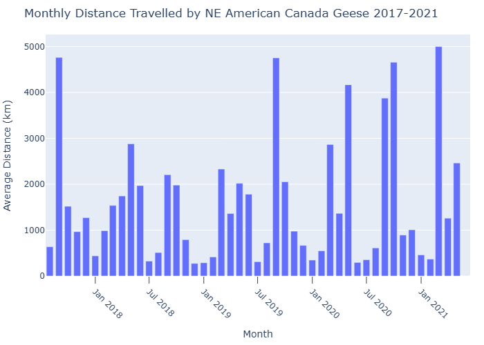

# Migration-Analysis
## Analyzing North-East Canadian geese migration trends using pandas

Seeing the geese in Waterloo got me thinking, where do they go anyways? While I couldn't find a dataset on Waterloo geese to answer the question for myself, I was able to find a dataset on [North-East American Canadian geese](https://www.movebank.org/cms/webapp?gwt_fragment=page%3Dstudies%2Cpath%3Dstudy2105214573) with 1,680,000+ data points to analyze.

## Questions I wanted answered
- What does their migration route look like?
- Where do the majority of geese tend to reside/lay over?
- What months have the most geese movement?

### What does their migration route look like?
To answer this, I created a visualization of the dataset using pandas and Plotly:
- Data is grouped into intervals of 3 days to reduce data points, lowering strain on the program
- Data is mapped starting from 2017-08-08 due to the lack of data points from 2015-2017
- Slider to view how geese distributions changed from 2017-2021

  

#### *[View interactive map](https://therealgecko.github.io/Migration-Analysis/)*

### Where do the majority of geese tend to reside/lay over?
To answer this, I generalized each latitude/longitude coordinate as a city/region and found the most common occurrences of the cities/regions.

#### Results 
<table>
  <thead>
    <tr>
      <th>Rank</th>
      <th>Location</th>
      <th>Region / Country</th>
      <th>Coordinates</th>
    </tr>
  </thead>
  <tbody>
    <tr>
      <td>1</td>
      <td>Vaughan</td>
      <td>ON, Canada</td>
      <td>(43.8, -79.5)</td>
    </tr>
    <tr>
      <td>2</td>
      <td>Baie-d'Hudson</td>
      <td>QC, Canada</td>
      <td>(59.9, -77.4)</td>
    </tr>
    <tr>
      <td>3</td>
      <td>Baie-d'Hudson</td>
      <td>QC, Canada</td>
      <td>(59.4, -77.7)</td>
    </tr>
    <tr>
      <td>4</td>
      <td>Syosset</td>
      <td>New York, USA</td>
      <td>(40.8, -73.5)</td>
    </tr>
    <tr>
      <td>5</td>
      <td>Pineville</td>
      <td>Pennsylvania, USA</td>
      <td>(40.3, -75.0)</td>
    </tr>
  </tbody>
</table>

Notes on the process:
- Originally, I was going to find each city/region for each data point using Geopy, but I ran into a blocker:
  - Would require me to send several hundred to thousand API requests to Geopy
  - Would require me to significantly reduce the number of data points to make the requests manageable
- Instead, I performed the following:
  - Rounded longitude/latitude values to the nearest 0.1 to get ~11 km resolution for city-level precision
  - Counted the top 5 repeating cities/regions
  - Plugged the 5 repeating regions into Google Maps to retrieve the names of the actual locations

## What months have the most geese movement?
Steps to determine this:
- Sum the distance traveled over several 3-day intervals throughout each month per goose  
- Take the average of all geese per each month

Notes on the process:
- Originally, Geopy's distance function was going to be used to calculate distances between points, but due to the volume of data points, the process was taking too long
- Resolved this by implementing a custom distance function
